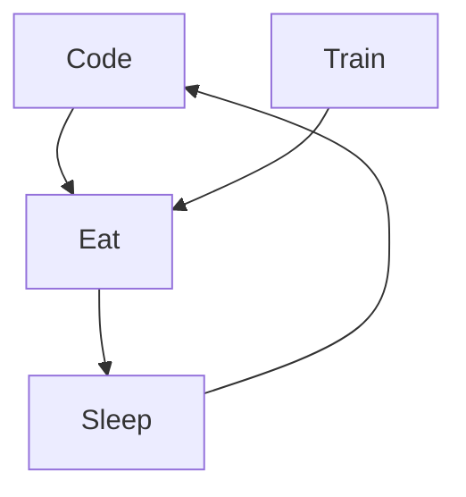

### Hi there 👋

- 🌱 I’m currently learning Java/Python
- 👯 I’m looking to collaborate on Java app projects
- 🤔 I’m looking for help with development of projects
- 💬 Ask me about Tech
- 📫 How to reach me: www.linkedin.com/in/ohini-jérémie-kuakuvi-a106b128a 
- 😄 Pronouns: He/Him
- ⚡ Fun fact: Technology💻, Manga, Basketball🏀

<h3 align="left">Connect with me:</h3>

### My daily routine :

         
  

Added the `Fri 03 May 2024`

Last update on Wed Sep 04 2024

**119 day before 2025 ⏱** days before new years

🤖 This README.md is updated with wickedness, by Gabot ❤️
