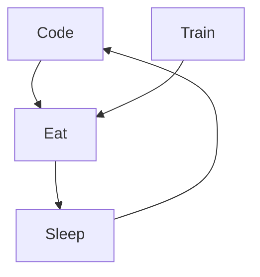

### Hi there 👋

- 🔭 I’m currently working on ...
- 🌱 I’m currently learning Java/Python
- 👯 I’m looking to collaborate on ...
- 🤔 I’m looking for help with development of projects
- 💬 Ask me about ...
- 📫 How to reach me: ...
- 😄 Pronouns: ...
- ⚡ Fun fact: ...

# GH-LIGHT-MODE-ONLY
# GH-DARK-MODE-ONLY

### Connect with me :

### Languages and Tools :

[]

[]

          

### My daily routine :

 

        
          
